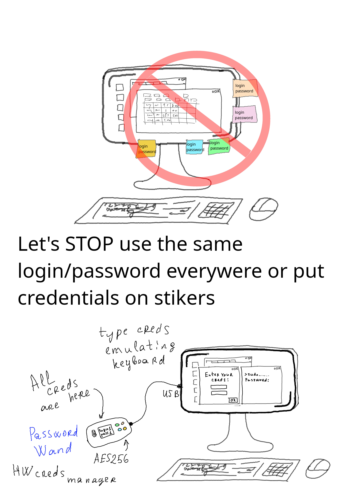

# PasswordWand

Hardware credential manager is secure replacement of stickers on monitor with login and passwords.

Separate device will store your credentials and type then into login forms.

Keep your creds in secret.

## Device Components

| Title | Aproximate Price | URL |
| ---- | ---- | ---- |
| nRF52840 Pro Micro | 4$ | [Aliexpress](https://aliexpress.ru/wholesale?SearchText=nrf52840+pro+micro&SortType=total_tranpro_desc) |
| SSD1306 I2C OLED display 128x64 0.96 inch | 1.2$ | [Aliexpress](https://aliexpress.ru/wholesale?SearchText=ssd1306+i2c+128+64&SortType=total_tranpro_desc) |
| Rotary Encoder with knob | 1$ | [Aliexpress](https://aliexpress.ru/wholesale?SearchText=rotary+encoder&SortType=total_tranpro_desc) |
| 4 x Button | less 1$ | [Aliexpress](https://aliexpress.ru/wholesale?SearchText=button&SortType=total_tranpro_desc) |
| 4 x 10 kOhm resistor | 0.1$ | [Aliexpress](https://aliexpress.ru/wholesale?SearchText=10+kohm+resistor&SortType=total_tranpro_desc) |
| 4 x 1 kOhm resistor | 0.1$ | [Aliexpress](https://aliexpress.ru/wholesale?SearchText=1+kohm+resistor&SortType=total_tranpro_desc) |
| 5 x 100uF conductor | 0.05$ | [Aliexpress](https://aliexpress.ru/wholesale?SearchText=100+uf+conductor&SortType=total_tranpro_desc) |
| 1 x 100nF conductor | 0.01$ | [Aliexpress](https://aliexpress.ru/wholesale?SearchText=100+nf+conductor&SortType=total_tranpro_desc) |
| Type-C cable | 1$ | [Aliexpress](https://aliexpress.ru/wholesale?SearchText=type+c+otg+cable&SortType=total_tranpro_desc) |
| Breadboard or Custom PCB | ? | |
| Total | 8.06$ + ? | |

## Library Dependencies

_Note: next list is under investigation after decision to change board from Arduino based to nRF52_

| Feature | Library | URL |
| ------- | ------- | --- |
| HID Keyboard | tinyUSB | https://github.com/hathach/tinyusb/ |
| OLED display | Adafruit_SSD1306 | |
| CLI | SimpleCLI | |
| Rotary Encoder | RotaryEncoder | |
| Settings Storage | arduino-NVM | |
| Creds Storage | arduino-NVM | |

## This project is fork of ...

... https://github.com/seawarrior181/PasswordPump

I'd like to thank Dan Murphy for PasswordPump. It's cool idea and device.
I'm appreciate how many features has been implemented in orignal sketch.

### Forking Reasons

PasswordPump usability is too complex by my opinion.
I'm sure that it's possible to make device more simple and usable.

PasswordPumpII project is exist but it's based on board which price is in 5-7 times higher then for Arduino Pro Micro. Such cool device as hardware credential manager should be as cheaper as possible to be more accecible.

## PasswordPump (original project)

GitHub: https://github.com/seawarrior181/PasswordPump

Author: Dan Murphy aka <seawarrior181>

An ATMega32u4 USB based credentials manager.
See www.5volts.org for more information.

## **!!! Warning !!!**

Project is under active development.
Please don't use it until first stable release.

# News

* All original code of PasswordPump has been removed from the project. Code base has been developed from scratch.
* AES128 has been replaced with AES256.
* Code related to authentication and encrypted storage has been covered by unit tests (AUnit has been used).
* Unfortunatelly **sketch is too big for Arduino Pro Micro**

# Roadmap

* Try to use NFR52840 Pro Micro instead of Arduino. We'll have 1MB flash instead of 32KB (where 4KB is reserved for bootloader) and 256KB RAM instead of 2.5KB
* Try to replace AES256 with AES128Tiny
* Make test device
* Finish MVP
* Make presentation materials

# PasswordWand Design

See design [DESIGN](DESIGN.md)

I hope that available and clear design can gain the trust of users.

Credential manager is device storing sensitive information and it's used for security purposes.

Customers may trust proprietary solutions due to manufacturer reputation even if device internals is unknown.

Small project should be opened to become acceptable alternative.

# Disclamers

The PasswordWand is not secure from keylogging attacks (https://en.wikipedia.org/wiki/Keystroke_logging).

Under no circumstances and under no legal theory, whether in tort (including negligence), contract, or otherwise, shall the creator of this device and software be liable to any person for any direct, indirect, special, incidental, or consequential damages of any character arising as a result of the use of the PasswordWand including, without limitation, damages for loss of goodwill, work stoppage, computer failure or malfunction, personal injury, death or any and all other damages or losses.

 This work is licensed under a <a rel="license" href="http://creativecommons.org/licenses/by-nc-sa/4.0/">Creative Commons Attribution-NonCommercial-ShareAlike 4.0 International License</a>.

This program and device are distributed in the hope that they will be useful, but WITHOUT ANY WARRANTY; without even the implied warranty of MERCHANTABILITY or FITNESS FOR A PARTICULAR PURPOSE.

# Links

* https://github.com/joric/nrfmicro/wiki/Alternatives?ysclid=mq2n5r73ga247364868
